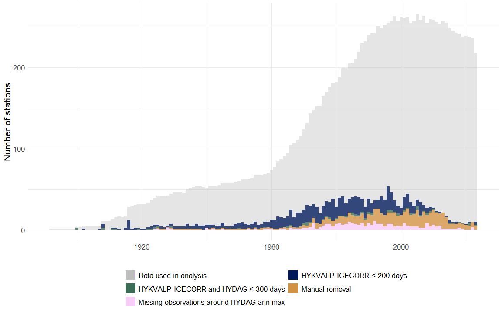
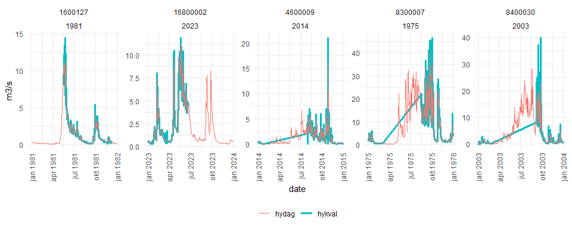

<h1 align="center">
floodGAM datasets
</h1>

## Overview

As part of the floodGAM analysis, we developed a flood dataset focused
on sub-daily sampling frequency.

NVE report 2016:85 [Flomdata: utvalg og kvalitetssikring av flomdata for
flomfrekvensanalyser](https://asp.bibliotekservice.no/nve/title.aspx?tkey=23147)
identifies 529 stations suitable for flood frequency analysis. We
independently evaluated each year of data at these stations for ability
to capture annual maxima at sub-daily sampling frequency. The result was
a set of 250 stations (the `gamfelt` dataset), each with at least 20
years of total data and at least 10 years of sub-daily data.

We provide both (i) the `gamfelt` dataset and (ii) all scripts and
resources needed to recreate the dataset from the raw data stored in
HYDRA II.

Feedback on the dataset is very welcome.

## How to get the data

The annual maxima, catchment descriptors, descriptive table and
statistical summary of the `gamfelt` dataset are stored in
[`/data/processed-data/gamfelt/`](/data/processed-data/gamfelt/)

## File structure

In addition to the `gamfelt` dataset, this data folder contains many
data products relevant to the larger floodGAM analysis (e.g. model
fitting and evaluation).

- `processed-data` – Any data loaded/manipulated/changed/saved with code
  from the `code` folders.

- `raw-data` – HYDRA II database commands and other raw data.

- `how-to-guides` – how to use the database commands in `raw-data`.

## Data pipeline

The data pipeline is the process of building the `gamfelt` dataset from
the raw streamflow data provided by NVE. The “findata quality control”
step is described in more detail in the following section.

### Dependencies

Building the dataset with the scripts in this repository requires:

- the NVE database **HYDRA II**
- access to the internal NVE system **lescon_var**
- the programming language **R**.

Some of the intermediate data files are large (part of the quality
control requires downloading and cross-checking the HYKVALP-ICECORR
database with HYDAG). Any data file over 50 Mb is stored on zenodo.

| Action                  | Description                                                                                                             | Requires                                                                                              | Output saved? | Where? |
|-------------------------|-------------------------------------------------------------------------------------------------------------------------|-------------------------------------------------------------------------------------------------------|:-------------:|:------:|
| Get streamflow data     | Download data from HYDRA II                                                                                             | lescon_var (internal system), [`lescon_var_commands.txt`](/data/raw-data/)                            |      \-       |   \-   |
| Change formatting       | Change downloaded data to .rds format                                                                                   | [`clean-and-process-rawdata-from-database.R`](/code/scripts/data-creation/)                           |      yes      | zenodo |
| Findata quality control | Choose excluded years/stations, handle missing data, check minimum time spacing at peaks, enforce minimum record length | [`quality-control-streamflow-data.R`](/code/scripts/data-creation/), [`utelatt.csv`](/data/raw-data/) |      yes      | zenodo |
| Process data            | Select annual maxima                                                                                                    | `write-this-script.R`                                                                                 |      yes      | github |

## Findata quality control

This step is how we check for sub-daily sampling frequency.

### Choose excluded years / stations

### Handle missing data and check minimum time spacing at peaks

### Enforce minimum record length

## Kvalitetskontroll av vannføringsdata

A big part of the dataset development was quality control to ensure the
findata was good enough. we desribe the process here

### Manuell fjerning

Rapporten 2016:85 identifiserer visse år med data som bør utelates for
flomfrekvensanalyse. I tillegg har vi identifisert noen år og stasjoner
som bør utelates hvis vi trenger fin tidsoppløsning.

- `utelatt.csv` - list over år og stasjoner som utelates
- `utelatt_notes.xlsx` - noen notater om manuelle fjernet år

### Håndtering av år med manglende data

NVE har ingen «perfekt» arkiv for verken findata eller døgndata. Noen
arkiver er isredusert, mens andre er ikke. Det samme gjelder
kompletthet.

Vi bruker data fra arkiv HYKALP-ICECORR (arkiv 35), som har
primærtkontrollerte data med fin/variabel tidsoppløsning og er virtuelt
isreduserte. HYKVALP-ICECORR er ikke sekundærkontrollert eller
kompletterte.

Fordi HYKVAL-dataene ikke er komplette, må vi derfor ta beslutninger om
hvordan vi skal håndtere år med manglende data. Vi velger å kryssjekke
HYKVALP-ICECORR dataene med data fra et annet arkiv, HYDAG (arkiv 05),
som inneholder kontrollerte, kompletterte døgndata som er isredusert og
etterkontrollert.

> NB: det kommer snart (slutten av 2024/tidlig 2025) en oppdatering i
> databasen. HYKVAL-data skal bli sekundærkontrollert etter en bestemt
> dato. Data før denne datoen skal ikke endres.

#### 1. Minimum antall dager i HYKVAL-ICECORR og HYDAG

Først teller vi antall dager / år for hvert år og hver stasjon. Da kan
vi fjerne år som har \< 200 dager i HYKVALP-ICECORR eller \< 300 dager i
både HYKVALP_ICECORR og HYDAG. Vi kan se på noen av årene vi fjerner:

**Eksemple av år fjernet p.g.a. \< 200 dager i HYKVALP-ICECORR:**

<!-- -->

**Eksemple av år fjernet p.g.a. \< 300 dager i begge arkivene:**

God overensstemmelse mellom arkivene her, men deler av året mangler.

<!-- -->

#### 2. Kryssjekke HYKVALP-ICECORR med HYDAG

Kriteriene for å kryssjekke med HYDAG er litt mer kompliserte. HYDAG og
HYKVALP-ICECORR samsvarer ikke perfekt. Det finnes noen stasjoner og år
som er i HYKVALP-ICECORR, men ikke i HYDAG, og omvendt:

``` r
# find unique station-year combinations in both hydag and hykvalp-icecorr:
hykval.sy <- data35[,unique(.SD),.SDcols = c("ID","yk")]
hydag.sy <- data05[,unique(.SD),.SDcols = c("ID","yk")]

setkey(hykval.sy,ID,yk); setkey(hydag.sy,ID,yk)
```

``` r
# station-years in hykvalp-icecorr *not* in hydag:
hykval.sy[, in.hydag := FALSE][hydag.sy, in.hydag := TRUE]
print(hykval.sy[in.hydag==FALSE], nrows = 5)
```

    ## Key: <ID, yk>
    ##           ID    yk in.hydag
    ##       <char> <num>   <lgcl>
    ##  1:  1200013  2023    FALSE
    ##  2: 12300029  1998    FALSE
    ##  3: 12300029  1999    FALSE
    ##  4: 12300029  2000    FALSE
    ##  5: 12300029  2001    FALSE
    ## ---                        
    ## 66:  7500022  2018    FALSE
    ## 67:  7500028  2023    FALSE
    ## 68:   800008  2003    FALSE
    ## 69:   800008  2004    FALSE
    ## 70:   800008  2005    FALSE

``` r
# station-years in hydag *not* in hykvalp-icecorr:
hydag.sy[, in.hykval := FALSE][hykval.sy, in.hykval := TRUE]
print(hydag.sy[in.hykval==FALSE], nrows = 5)
```

    ## Key: <ID, yk>
    ##           ID    yk in.hykval
    ##       <char> <num>    <lgcl>
    ##   1: 1100004  1975     FALSE
    ##   2: 1100004  1976     FALSE
    ##   3: 1500053  1969     FALSE
    ##   4: 1500053  1973     FALSE
    ##   5: 1500053  1974     FALSE
    ##  ---                        
    ## 279: 8300006  1970     FALSE
    ## 280: 8300006  1971     FALSE
    ## 281: 9800004  1979     FALSE
    ## 282: 9800004  1980     FALSE
    ## 283: 9800004  1981     FALSE

Det er 70 år hvor vi har data i HYKVALP-ICECORR, men ikke i HYDAG. For
de resterende 14 156 år hvor vi har data både i HYKVALP-ICECORR og
HYDAG, utfører vi en årlige maksimumskontroll:

Beregne de årlige maksimumene med HYDAG. Sjekk om HYKVALP-ICECORR
inneholder en observasjon innenfor +/- 48 timer fra datoen da det årlige
maksimumet fra HYDAG ble observert. Hvis det ikke er noen
HYKVALP-ICECORR observasjon innenfor +/- 48 timer fra det nødvendige
punktet, fjern året.

Vi kan se på noen av årene vi fjerner:

<!-- -->
