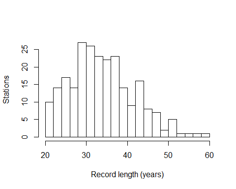

# The `gamfelt` dataset

This folder contains the annual maxima and catchment descriptors for the
`gamfelt` dataset.

## File structure

- `gamfelt_1hour_annual_maxima` - the annual maxima, in $m^3/s$. Data
  from archive hyfin-complete. Interpolated to hourly values and annual
  maxima extracted (see processing scripts
  [here](~/floodGAM/code/scripts/1-data-creation/)). Saved as both
  `.csv` and `.rds`.
- `gamfelt_catchment_covariates` - catchment descriptors for each
  gamfelt station. Saved as both `.csv` and `.rds`.
- `gamfelt_catchment_covariates_description.txt` - description of each
  variable in the catchment descriptor dataset.

## Describing the dataset

The `gamfelt` dataset contains annual maxima for 241 stations in Norway.
Each station has at least 20 years of fine data.

The stations represent a reasonably diverse collection of catchment
sizes and hydroclimatic regimes:

<!-- -->

Total record lengths range from a minimum of 20 years of data to around
60 years of fine (sub-daily) data:

<!-- -->
