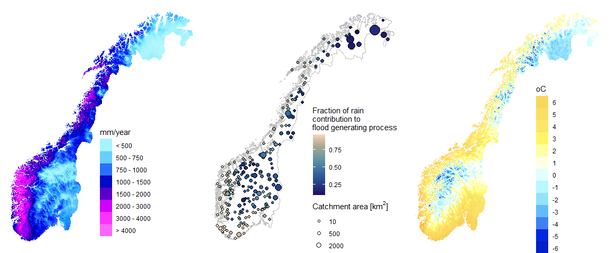

# The `gamfelt` dataset

This folder contains the annual maxima and catchment descriptors for the
`gamfelt` dataset. We summarize some properties of the dataset below.

## File structure

- `gamfelt_annual_maxima` - the annual maxima, in $m^3/s$.
- `gamfelt_catchment_descriptors` - catchment descriptors for each
  gamfelt station.
- `README-catchment-descriptors.txt` - description of each variable in
  the catchment descriptor dataset.

## Describing the dataset

The `gamfelt` dataset contains annual maxima for 249 stations in Norway.
Each station has at least 20 years of total data and 10 years of
sub-daily (fine) data. Each year of data has been assessed using the
process described in the [data README](/data/README.md).

The stations represent a reasonably diverse collection of catchment
sizes and hydroclimatic regimes:

<!-- -->

| Catchment area ($km^2$) | 0 - 2 $km^2$ | 2 - 10 $km^2$ | 10 - 60 $km^2$ | 60 - 100 $km^2$ | 100 - 500 $km^2$ | 500+ $km^2$ |
|:-----------------------:|:------------:|:-------------:|:--------------:|:---------------:|:----------------:|:-----------:|
| **Number of stations**  |      2       |      18       |       67       |       27        |        94        |     39      |

### Record lengths

Each of the streamflow records contains a variety of collection methods.
These differing collection methods provide data at different
frequencies. Generally, the earlier part of the streamflow record has
daily time resolution, while the later part of the record contains a
higher frequency of measurements after adoption of digitized limnigraph
records and/or digital measurements. For our dataset, the shift to a
higher frequency of measurements is typically around 1980, and stations
have, on average, 34 years of high frequency (fine) data.

Total record lengths in our data set range from a minimum of 20 years of
data to 131 years at station 62.5 (Bulken).

<!-- -->

Half of the stations (123 stations) have more than 90% of the record
made up of fine data.

Around 20% of the stations (49 stations) have less than half the record
made up of fine data. These stations showing a low percentage of fine
data are characterized by having a long total record length compared to
the fine (subdaily) record length, i.e. in these cases, the amount of
subdaily data is not below average; rather, the overall record length is
extensive. The median total record length at these stations is 97 years.

## Considerations when using the `gamfelt` dataset

<!-- -->
